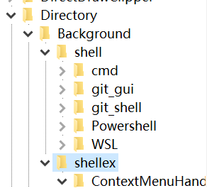

<meta name="created" content="2019-11-07">
<meta http-equiv="Content-Type" content="text/markdown; charset=utf-8">

# Windows鼠标右键菜单的注册表设置

  一般来说Windows的右键菜单简洁一些比较好，因为这个菜单里面的某些功能还是很常用的，假如被一些不太常用的功能拖慢了响应速度，就非常非常过分地影响使用体验；

  （这里吐槽一下Windows右键菜单的“新建”菜单栏子项，显示速度异常地慢，也不知道是怎么搞得不对劲；
  
  一般来说Windows的右键菜单可以在注册表"\HKEY_CLASSES_ROOT\Directory\Background\shellex\"这个键值和它周围的键值里面找到配置的方法；
  
  最简单的方式是把键值删掉，但是有些功能呢，又不是很想彻底删掉，这时候就可以考虑Windows扩展的右键菜单功能了；
  
  ## 方案1：
  
  比如说吧，安装了git-scm之后，右键菜单里面就会出现一些奇奇怪怪的内容，如何把他们藏起来呢？
  
  
  方法很简单，在键值里加入一个字符串类型的变量，命名为"Extended"就好了；
  
  
  用的时候如何调出来呢？
  
  在这个菜单本来应该出现的地方 Shift + RightClick 就可以了
  
  ## 方案2：
  
  有些软件比较“热情”，它们的右键菜单用这个方法无法隐藏(其实是和键的属性有关)，比如OneDrive
  
  这个方案有一些不太完美：在该菜单的键值里面的"（默认）"字符串变量的值前面加"- "
  
  这样的话确实隐藏了...不过一般也调出不来了（总比删了没法恢复要好
  
  
  参考文章：
  
  1. [Windows下的右键菜单管理](https://huyinjie.xyz/2017/12/07/Windows%E4%B8%8B%E7%9A%84%E5%8F%B3%E9%94%AE%E8%8F%9C%E5%8D%95%E7%AE%A1%E7%90%86/)
  2. [Windows系统如何（临时）删除右键菜单里的项目](https://www.xstui.com/read/509)

  Knighthana
  
  2019年11月7日 于西电
  