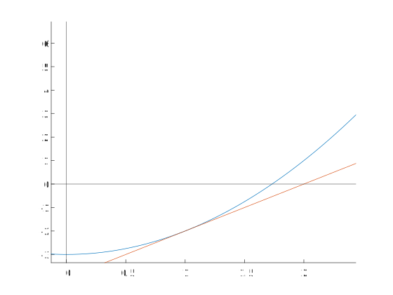
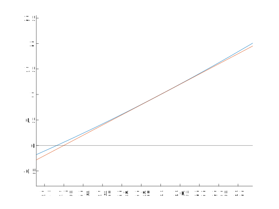

# 用牛顿-拉弗森迭代法求解平方根及其他

牛顿-拉弗森方法是个很有用的方法，在没有计算器需要手算一些式子的时候，其它的运算可能只是需要多花点时间，但对于开平方一类运算必须要有一个数学工具才能开始求解

即便这个方法如此重要，我还是总会忘记，我记得高中的时候受“卡马克魔数”的影响，明明用C写过一个迭代法开平方的程序，还专门和系统自带的`sqrt()`函数比较过运行速度，但是如今又是全都忘了

今天就找资料，重新学一下这个东西。

## 核心的公式

手算开平方，核心的公式就一个：

$$
x_{n+1}=x_n+\frac{x_n^2-a}{2\cdot x_n}
$$

选择一个接近平方根的值作为
$x_0$
代入
$x_n$
开始第一遍计算，获得等式左边
$x_1$
的值，将
$x_1$
代入右侧算式得到
$x_2$
的值，之后每次计算都会更接近
$
x^2-a=0
$
的解

### 几何过程，试着理解

$y=f(x)$
是函数的图像，
对于
$y_0=f(x_0)$
，
$(x_0,y_0)$
点是表示函数在
$x=x_0$
处取值的点

$y=f'(x)$
是斜率与函数图像在
$x$
点处斜率的相等的一条直线

过定点直线的方程
$y-y_0=k(x-x_0)$

那么，
$y-y_0=f'(x_0)\cdot(x-x_0)$
就是一条过函数图像上(x_0,y_0)处与函数图像相切的直线

求出直线与x轴的交点，也就是直线对应的方程在
$y=0$
时的解，这个值是
$x_1$

然后对
$x_1$
重复一遍上述过程得到
$x_2$

例如，对于
$x^2=3$
求x的平方根

先将其转换成
$f(x)=x^2-3$
的形式

猜想解在1附近，于是假设
$x_0=1$
画一张图看看

然后根据焦点，代入$x_1=2$，再画一张图

可以看到，随意取了一个1，仅仅经过两次迭代，就快速逼近了真正的解

这个方法既适合手算，也适合编程序去计算

## 其他

事实上，牛顿-拉弗森方法是用函数
$f(x)$
的泰勒级数的前几项来寻找方程
$f(x)=0$
的根

这个方法还可以用于其他方程的求解，式子是这样的

$$
x_{n+1}=x_n-\frac{f(x_n)}{f'(x_n)}
$$

这个式子是有[使用条件](https://zh.wikipedia.org/wiki/%E7%89%9B%E9%A1%BF%E6%B3%95#:~:text=%E6%95%9B%5B1%5D-,%E5%BF%85%E9%A1%BB%E6%BB%A1%E8%B6%B3%E4%BB%A5%E4%B8%8B%E6%9D%A1%E4%BB%B6,-%EF%BC%9A)的

此外，这个方法还可以用于求极值点

$$
x_{n+1}=x_n-\frac{f'(x_n)}{f''(x_n)}
$$

Knighthana

2023/04/02

## 参考资料

[1] 如何通俗易懂地讲解牛顿迭代法？ https://www.matongxue.com/madocs/205/

[2] 牛顿法 https://zh.wikipedia.org/wiki/%E7%89%9B%E9%A1%BF%E6%B3%95

[3] [有趣数学-Bilibili](https://www.bilibili.com/video/BV1KT4y1N7Sq/)

[Newton-Raphson method | Animated and explained | Algorithm for finding roots of a function Youtube](https://www.youtube.com/watch?v=qlNqPE_X4ME)

## Tag

Newton-Raphson; sqrt(); Carmack
