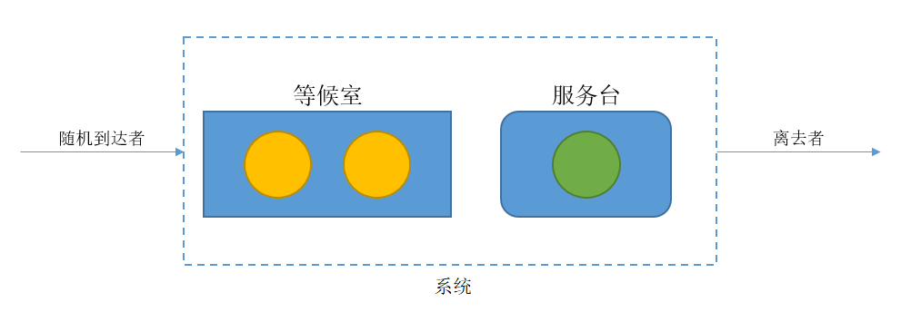

# 一步状态转移概率矩阵

[TOC]

## 定义一步状态转移概率矩阵

**马尔科夫性质**指的是具有该性质的随机过程在
$t_n$
时刻所处状态为已知时，过程在大于
$t_n$
的时刻所处状态的概率特性只与过程在
$t_n$时刻所处的状态有关，而与过程在$t_n$时刻以前的状态无关，又称此性质为**无后效性**

离散状态空间的马尔科夫过程称为马尔科夫链，由于具有马尔科夫性质的随机过程具有无后效性，所以考虑马尔科夫链上进行状态转移的情况时，只需要考虑此时刻所处的状态，以及将要转移向的状态，而且令人欣喜的是，在任意时刻的这种考虑都是正确的，不必担心时间的影响

那么，不难发现，对于具有马尔科夫性质的随机过程，其在每个状态下向其他任何已知状态转移的概率都是已知的

试图定义马尔科夫链n时刻的k步状态转移概率，n时刻马尔科夫链处于状态i，经过k步，系统处于j状态的概率

这里说“转移了k步”是因为我们在讨论离散时间问题，对于其中每个定义的有意义的时刻，我们说这是“一步”

复习一下概率论中学习过的内容，条件概率等于积事件的概率比上前置事件的概率，
$P(A|B)=P(\frac{AB}{B})$

于是定义k步转移概率为

$p^{(k)}_{ij}(n)=p_{ij}(n,n+k)=p\{X(n+k)=j|X(n)=i\}$

重复一遍，这个公式中，k代表“k步”，i代表n时刻所处的状态，j是在k步之后要转移到的状态，一个p用括号把它们括起来，代表这件事情发生的概率

由于整个样本空间中所有事件之和发生的概率为1，所以有
$\sum_{j=1}^{\infty }p_{ij}(n,n+k)=1, i=1,2,... $

这个式子的含义是，假设整个系统有｛1, 2, …… , N｝共N个状态

对于
$i=1$
，有
$p_{11}(n,n+k)+p_{12}(n,n+k)+...+p_{1N}(n,n+k)=1$

对于
$i=2$
，有
$p_{21}(n,n+k)+p_{22}(n,n+k)+...+p_{2N}(n,n+k)=1$

对于
$i=3$
，有
$p_{31}(n,n+k)+p_{32}(n,n+k)+...+p_{3N}(n,n+k)=1$

……

对于$i=N$，有$p_{N1}(n,n+k)+p_{N2}(n,n+k)+...+p_{NN}(n,n+k)=1$

**但是**，我们平常用不上k步状态转移概率

最重要、实际中最常用的是一步状态转移概率
$p_{ij}=P_{ij}(1)=P\{X_{n+1}=j|X_{n}=i\}$
，而且一般来说也只研究一步状态转移概率

注意，对于一步状态转移概率矩阵，上面说的公式仍然以
$\sum_{j=1}^{\infty }p_{ij}(n,n+1)=1, i=1,2,... $
的形式成立

如何画出一步状态转移概率矩阵呢？

首先明确，一步状态转移概率矩阵是一个
$N\times N$
的正方形矩阵

将n时刻的状态（这是一个样本空间）纵向排布，

将n+1时刻的状态（这是另一个样本空间）横向排布，

把i放在铅直方向，排成一竖列，把j放在水平方向，排成一横行

在矩阵中放入每个
$p_{ij}$

$p_{ij}$
即系统从i状态一步转移到j状态的概率，例如
$p_{13}$
指系统从状态1一步转移到状态3的概率

注意，i和j可以相同，因此
$p_{11}$
也是有效的，指的是系统此时刻状态为1，一步转移到状态1的概率，也就是状态保持不变的概率，这个状态保持不变，既有可能是系统没有发生变化，也有可能是系统内发生了均衡的变化

$$
X_{n+1}的状态
$$

$$
1\quad 2\quad...\quad j\quad...
$$

$$
\begin{bmatrix}
 p_{11} & p_{12} & ... & p_{1j} & ...\\
 p_{21} & p_{22} & ... & p_{2j} & ...\\
 ... & ... & ... & ... & ...\\
 p_{i1} & p_{i2} & ... & p_{ij} & ...\\
 ... & ... & ... & ... & ...
\end{bmatrix}
$$

Latex不支持在矩阵纵向的方括号外面注释，纵向应该要写“
$X_{n}$
的状态”和“1 2 ... i ...”

注意，
$\sum_{j=1}^{\infty }p_{ij}(n,n+1)=1, i=1,2,... $
这个性质仍然有效

因此，在矩阵中，每一横行的概率之和应当为1，这是验证所画出矩阵是否正确的一个方法

这里矩阵看懂了怎么回事最好，如果没看懂怎么画也没关系，可以看“举例说明”一节

继续搬教材：

> 随机过程与排队论课程研究时间齐次马尔科夫过程，简称时齐马尔科夫过程，它满足

> $P\{X(t)\le x|X(t_n)=x_n\}=P\{X(t-t_n)\le x|X(0)=x_n\}$

> 其中假定系统的行为不依赖于观测的时间，即马尔科夫过程中的条件分布函数不随观察起始时刻的变化而变化，我们可以任选时间轴的起点

这一坨公式看不懂也没关系，最重要的一句话就是“我们可以任选时间轴的起点”

这句话的影响就是后面我在行文中可能随时混淆“n时刻”和“当下时刻”，还可能混淆“n+1时刻”和“下一时刻”

因为对于一个时间齐次的马尔科夫过程，无论从哪个时刻切入问题，系统的性质都是不变的，所以其实都是一样的

## 理解这个东西有什么意义

这里引用一下我老师的话，经过二道转述可能不全

> 状态转移概率矩阵P，是状态转移的桥梁，

> 运用状态转移概率矩阵P，可令系统从n状态转移到n+1状态，n+2状态，n+3状态，……

> $X_0 \cdot P = X_1 , \quad X_1 \cdot P = X_2 , \quad X_2 \cdot P = X_3 , \quad ... ,\quad X_{n-1} \cdot P = X_n$

> 我们可以通过P去研究一个随机的过程，可以用P去预测系统未来的状态

> 若

> $\lim_{x \to \infty} X_{n-1} \cdot P = X_{n} =X$

> 则称状态转移后收敛于一个稳定的状态

## 举例说明

下面用三个例子来说明如何构建一步状态转移概率矩阵

### 一维随机游走问题

设一质点在如图所示的直线的点集I={1,2,3,4,5}上随机游动，并仅在1秒，2秒等等整秒的时刻发生游动。


游动的规则是：

1. 如果Q现在位于点i (1< i <5)，则下一时刻各以
$\frac{1}{3}$
的概率向左或向右移动一格，或以
$\frac{1}{3}$
的概率留在原处；
2. 如果Q现在位于1(或5)点上，则下一时刻就以概率1移动到2(对应地，或4)这一点上。

1和5这两点称为反射壁。本例这种游动称为带有两个反射壁的随机游动

我觉得这个条件1的说法不太好，假如写成“如果Q现在位于点i，
$i\in \{2,3,4\}$
则下一时刻各以
$\frac{1}{3}$
的概率向左或向右移动一格，或以
$\frac{1}{3}$
的概率留在原处；”，会更明确一些，因为我们研究的是离散的点，不是连续的点，这不是在C语言里面用大小于号往离散值上面标循环条件，标完了还得想一下到底是循环多少次

#### 解：

1. 列出状态的所有可能取值
$\Omega=\{1,2,3,4,5\}$

2. 画出矩阵P

$$
\begin{bmatrix}
 p_{11} & p_{12} & p_{13} & p_{14} & p_{15}\\
 p_{21} & p_{22} & p_{23} & p_{24} & p_{25}\\
 p_{31} & p_{32} & p_{33} & p_{34} & p_{35}\\
 p_{41} & p_{42} & p_{43} & p_{44} & p_{45}\\
 p_{51} & p_{52} & p_{53} & p_{54} & p_{55}
\end{bmatrix}
$$

3. 求出每个
$p_{ij}$
的值，填入矩阵中

因为是初学，所以这里一个一个算，

首先
$p_{11}$
啥意思，我们解读一下，在
$p_{11}$
中，下标前面的数字是1，也就是说
$i=1$
，下标后面的数字是1，也就是说
$j=1$

那么
$p_{11}$
的值就是指，本时刻的状态值为1，下一时刻的状态为1的概率，就是说，“下一时刻状态还为1”的概率

这里也可以说，“系统在n时刻状态为1，n+1时刻状态为1的概率”

理解这个“n时刻”和“本时刻”、“n+1时刻”和“下一时刻”在研究时齐马尔科夫过程的过程中，可以方便地混用的特性

查询题目条件，

> 2. 如果Q现在位于1(或5)点上，则下一时刻就以概率1移动到2(对应地，或4)这一点上。

那么，“本时刻状态为1，下一时刻状态仍为1”是一个不可能事件，不可能事件的概率为0

于是
$p_{11}=0$
，填入矩阵

$$
\begin{bmatrix}
 0 & p_{12} & p_{13} & p_{14} & p_{15}\\
 p_{21} & p_{22} & p_{23} & p_{24} & p_{25}\\
 p_{31} & p_{32} & p_{33} & p_{34} & p_{35}\\
 p_{41} & p_{42} & p_{43} & p_{44} & p_{45}\\
 p_{51} & p_{52} & p_{53} & p_{54} & p_{55}
\end{bmatrix}
$$

然后解读下一个，求概率值，下一个是
$p_{12}$
用汉语来解释，就是说，系统此时刻状态为1，下一时刻状态为2，查询题目条件，

> 2. 如果Q现在位于1(或5)点上，则下一时刻就以概率1移动到2(对应地，或4)这一点上。

那么很容易得出这里的概率值为1，于是我们把1填入概率矩阵中
$p_{12}$
的位置

$$
\begin{bmatrix}
 0 & 1 & p_{13} & p_{14} & p_{15}\\
 p_{21} & p_{22} & p_{23} & p_{24} & p_{25}\\
 p_{31} & p_{32} & p_{33} & p_{34} & p_{35}\\
 p_{41} & p_{42} & p_{43} & p_{44} & p_{45}\\
 p_{51} & p_{52} & p_{53} & p_{54} & p_{55}
\end{bmatrix}
$$

对于
$p_{13},p_{14},p_{15}$
这三点，从上面多次引用的题目条件中，不难得到，它们都是不可能事件，不可能事件的概率为0，因此把0填入矩阵中这三点的位置

$$
\begin{bmatrix}
 0 & 1 & 0 & 0 & 0\\
 p_{21} & p_{22} & p_{23} & p_{24} & p_{25}\\
 p_{31} & p_{32} & p_{33} & p_{34} & p_{35}\\
 p_{41} & p_{42} & p_{43} & p_{44} & p_{45}\\
 p_{51} & p_{52} & p_{53} & p_{54} & p_{55}
\end{bmatrix}
$$

第一次验算，将矩阵第一行求和
$\sum (0,1,0,0,0)=1$，基本没问题，继续

$p_{21}$
说的是“本时刻系统处于状态2，下一时刻状态转移至1的概率”，查询题目条件，

> 1. 如果Q现在位于点i (1< i <5)，则下一时刻各以
$\frac{1}{3}$
的概率向左或向右移动一格，或以
$\frac{1}{3}$
的概率留在原处；

以及我转换过后的说法

> 如果Q现在位于点i，
$i\in \{2,3,4\}$
则下一时刻各以
$\frac{1}{3}$
的概率向左或向右移动一格，或以
$\frac{1}{3}$
的概率留在原处；

于是不难得出，“本时刻系统处于状态2，下一时刻系统状态转移至1的概率”是
$\frac{1}{3}$

把算出的
$p_{21}$
的值
$\frac{1}{3}$
填入表——不是，“矩阵”中

于是我们得到了

$$
\begin{bmatrix}
 0 & 1 & 0 & 0 & 0\\
 \frac{1}{3} & p_{22} & p_{23} & p_{24} & p_{25}\\
 p_{31} & p_{32} & p_{33} & p_{34} & p_{35}\\
 p_{41} & p_{42} & p_{43} & p_{44} & p_{45}\\
 p_{51} & p_{52} & p_{53} & p_{54} & p_{55}
\end{bmatrix}
$$

然后算
$p_{22}$

假如点位于{2, 3, 4}中的任意一点，那么它要么以
$\frac{1}[3]$
的概率向左移动1格，要么以
$\frac{1}[3]$
的概率留在原地，要么以
$\frac{1}[3]$
的概率向右移动一格

$p_{22}$
的意思是“留在原地的概率”，那就是
$\frac{1}{3}$

于是我们得到了更新后的矩阵

$$
\begin{bmatrix}
 0 & 1 & 0 & 0 & 0\\
 \frac{1}{3} & \frac{1}{3} & p_{23} & p_{24} & p_{25}\\
 p_{31} & p_{32} & p_{33} & p_{34} & p_{35}\\
 p_{41} & p_{42} & p_{43} & p_{44} & p_{45}\\
 p_{51} & p_{52} & p_{53} & p_{54} & p_{55}
\end{bmatrix}
$$

类似地，
$p_{23}=\frac{1}{3}$

更新之后

$$
\begin{bmatrix}
 0 & 1 & 0 & 0 & 0\\
 \frac{1}{3} & \frac{1}{3} & \frac{1}{3} & p_{24} & p_{25}\\
 p_{31} & p_{32} & p_{33} & p_{34} & p_{35}\\
 p_{41} & p_{42} & p_{43} & p_{44} & p_{45}\\
 p_{51} & p_{52} & p_{53} & p_{54} & p_{55}
\end{bmatrix}
$$

然后是
$p_{24}$
，题目中是否允许由2→4这样的一步状态转移呢？没有，那么系统状态在一步进行2→4的状态转移是一个不可能事件，不可能事件的概率为0，于是
$p_{24}=0$
填入矩阵中

$$
\begin{bmatrix}
 0 & 1 & 0 & 0 & 0\\
 \frac{1}{3} & \frac{1}{3} & \frac{1}{3} & 0 & p_{25}\\
 p_{31} & p_{32} & p_{33} & p_{34} & p_{35}\\
 p_{41} & p_{42} & p_{43} & p_{44} & p_{45}\\
 p_{51} & p_{52} & p_{53} & p_{54} & p_{55}
\end{bmatrix}
$$

同理，一步进行2→5状态转移也是不允许的，这是不可能事件，不可能事件的概率为0，
$p_{25}=0$

$$
\begin{bmatrix}
 0 & 1 & 0 & 0 & 0\\
 \frac{1}{3} & \frac{1}{3} & \frac{1}{3} & 0 & 0\\
 p_{31} & p_{32} & p_{33} & p_{34} & p_{35}\\
 p_{41} & p_{42} & p_{43} & p_{44} & p_{45}\\
 p_{51} & p_{52} & p_{53} & p_{54} & p_{55}
\end{bmatrix}
$$

这样我们完成了矩阵的第二行，不要忘记验算

$\frac{1}{3}+\frac{1}{3}+\frac{1}{3}+0+0=1$
可以认为第二行是正确的

继续进行下一步，算矩阵的第三行

我相信阅读到这里的读者应该很容易看出，矩阵第三行的数值应该是

$$
\begin{matrix}
 0 & \frac{1}{3} & \frac{1}{3} & \frac{1}{3} & 0
\end{matrix}
$$

把它填入矩阵中，替换

$$
\begin{matrix}
p_{31} & p_{32} & p_{33} & p_{34} & p_{35}
\end{matrix}
$$

这一行，于是得到了

$$
\begin{bmatrix}
 0 & 1 & 0 & 0 & 0\\
 \frac{1}{3} & \frac{1}{3} & \frac{1}{3} & 0 & 0\\
 0 & \frac{1}{3} & \frac{1}{3} & \frac{1}{3} & 0\\
 p_{41} & p_{42} & p_{43} & p_{44} & p_{45}\\
 p_{51} & p_{52} & p_{53} & p_{54} & p_{55}
\end{bmatrix}
$$

同样进行验算，矩阵第三行之和为1，没有出错，

再算出第四行和第五行并进行验算，核对无误之后，于是我们得到了本题的一步状态转移概率矩阵为

$$
\begin{bmatrix}
 0 & 1 & 0 & 0 & 0\\
 \frac{1}{3} & \frac{1}{3} & \frac{1}{3} & 0 & 0\\
 0 & \frac{1}{3} & \frac{1}{3} & \frac{1}{3} & 0\\
 0 & 0 & \frac{1}{3} & \frac{1}{3} & \frac{1}{3}\\
0 & 0 & 0 & 1 & 0
\end{bmatrix}
$$

完事！

#### 扩展思考

本题中给出的是反射壁，也可以更改为吸收壁的形式

字面理解吸收壁的含义，就是一旦点移动到这里，就会被牢牢吸住，无法再移动，那么不难得出，对于一个位置i的吸收壁，
$p_{ii}$的概率为1

假如我们将本题的点1改为吸收壁，那么原本的第一行

$$
\begin{matrix}
0 & 1 & 0 & 0 & 0
\end{matrix}
$$

就会变成

$$
\begin{matrix}
1 & 0 & 0 & 0 & 0
\end{matrix}
$$

假如我们将点1替换为吸收壁，那么原本的一步状态转移就变成了如下的形式

$$
\begin{bmatrix}
 1 & 0 & 0 & 0 & 0\\
 \frac{1}{3} & \frac{1}{3} & \frac{1}{3} & 0 & 0\\
 0 & \frac{1}{3} & \frac{1}{3} & \frac{1}{3} & 0\\
 0 & 0 & \frac{1}{3} & \frac{1}{3} & \frac{1}{3}\\
0 & 0 & 0 & 1 & 0
\end{bmatrix}
$$

如果点1保持为最初的反射壁不变，而将点5单独更换为吸收壁，矩阵应该是什么样子的？

不难想象，矩阵会变成如下形式

$$
\begin{bmatrix}
 0 & 1 & 0 & 0 & 0\\
 \frac{1}{3} & \frac{1}{3} & \frac{1}{3} & 0 & 0\\
 0 & \frac{1}{3} & \frac{1}{3} & \frac{1}{3} & 0\\
 0 & 0 & \frac{1}{3} & \frac{1}{3} & \frac{1}{3}\\
0 & 0 & 0 & 0 & 1
\end{bmatrix}
$$

如果我们将点1和点5都由原本的样子更换成为吸收壁，读者不妨思考一下矩阵的样子

这应该也不难想象

$$
\begin{bmatrix}
 1 & 0 & 0 & 0 & 0\\
 \frac{1}{3} & \frac{1}{3} & \frac{1}{3} & 0 & 0\\
 0 & \frac{1}{3} & \frac{1}{3} & \frac{1}{3} & 0\\
 0 & 0 & \frac{1}{3} & \frac{1}{3} & \frac{1}{3}\\
0 & 0 & 0 & 0 & 1
\end{bmatrix}
$$

### 0-1传输系统问题

只传输数字0和1的串联系统，如图所示，每一级的传真率为
$p$
，误码率为
$q=1-p$
，设一个单位时间传输一级，
$X_0$是第一级的输入，
$X_n$是第n级的输出。


这个系统和前面所说的“系统”有点不太一样，上一个例题中，研究的是同一系统（同一空间）不同时刻的状态，非常自然地获得了在时间上状态转移的关系，而本题中，我们仍然有一整个系统，但这一次时间和空间都在变化，难道要画出整个传输系统的一步状态转移概率矩阵吗？

如果我们仍然仅仅把研究的目光放在
$X_n$
和
$X_{n+1}$
两个被传输的数据，在经过同一节点前后的状态转移关系上，而不去考虑其他问题，不难发现，这仍然是一个时齐马尔科夫过程

#### 解

1. 列出状态的所有可能取值
$\Omega=\{0,1\}$

2. 画出矩阵P

$$
\begin{bmatrix}
 p_{00} & p_{01} \\
 p_{10} & p_{11} \\
\end{bmatrix}
$$

3. 求出每个
$p_{ij}$
的值，填入矩阵中

$p_{00}$
指经过节点之前，被传输的数据是0，在经过节点之后，被传输的数据仍然是0，也即“保真”传输，那么这个概率就是题目中所说的“传真率”
$p$

$p_{01}$
指经过节点之前，被传输的数据是0，在经过节点之后，数据变成了1，这说明节点上的传输发生了错误，这个概率就是题目中所说的“误码率”
$q$
，根据题目，有
$q=1-p$

进行验算，
$p_{00}+p_{01}=p+q=p+1-p=1$
，认为列出本行无误

同理，
$p_{10}=q$
，
$p_{11}=p$
，于是我们获得了本例的一步状态转移概率矩阵

$$
P=
\begin{bmatrix}
p & q \\
q & p
\end{bmatrix}
$$

这样写比较简洁，如果写成

$$
P=
\begin{bmatrix}
p & 1-p \\
1-p & p
\end{bmatrix}
$$

的形式，露出了它被掩盖的本质，更加明了一些

### 简单排队模型

设服务系统有一个服务员和只可以容纳两个人的等候室组成，如图



服务规则是：先到先服务，后来者需在等候室依次排队，假定一个需要服务的顾客到达系统时发现系统内已有3个顾客（一个正在接受服务，两个在等候室排队），则该顾客离去。

设时间间隔
$\triangle t$
内将有一个顾客进入系统的概率为
$q$
，有一原来被服务的顾客离开系统（即服务完毕）的概率为
$p$
。
又设当
$\triangle t$
充分小时，在这一时间间隔内多于一个顾客进入或离开系统实际上是不可能的。
再设有无顾客来到与服务是否完毕是相互独立的。

#### 解

这道题是个完全的排队论问题

一、首先，按照坎达尔排队理论的A/B/C排队表示法描述问题

1. 输入过程（到达的规则）：这个分布我们实际上是不知道的，我们完全可以假设是以泊松分布进行的，当然任何情况都有可能并不局限于此，不过本题提供了单位时间
$\triangle t$
内有一位顾客到达的概率就是
$q$
所以无论是什么分布，这个概率
$q$
是非常确凿的

2. 处理过程（服务的规则）：我们仍然不知道此随机变量的分布，但是我们知道
单位时间
$\triangle t$
内有一位顾客被服务完毕并且离开的概率是
$p$
，没有规定，我们就可以随意假设，比如说假设它是一个负指数分布，只要令它在
$\triangle t$
的概率等于
$p$
即可

3. 服务窗口个数：1

4. 系统容量（包括处理窗口容量和缓存Buffer容量的总和）：3

5. 仍然在等待的输入（待服务的顾客）：
$\infty$

二、系统是否具有马尔科夫性质？系统是马尔科夫链

三、画矩阵：

1. 系统的状态集合
$\Omega=\{0,1,2,3\}$

2. 系统共有4个状态，因此需要画出一个
$4\times 4$
矩阵

$$
\begin{bmatrix}
 p_{00} & p_{01} & p_{02} & p_{03}\\
 p_{10} & p_{11} & p_{12} & p_{13}\\
 p_{20} & p_{21} & p_{22} & p_{23}\\
 p_{30} & p_{31} & p_{32} & p_{33}
\end{bmatrix}
$$

3. 算出每个一步状态转移概率
$p_{ij}$
填入矩阵

$p_{00}$
指“系统内没有顾客，经
$\triangle t$
后仍然没有顾客的概率”

那么，0→0有没有可能标识的是在
$\triangle t$
内，来了一个顾客，且服务完毕让他走了呢？

不行，
> 当
$\triangle t$
充分小时在这一时间间隔内多于一个顾客进入或离开系统实际上是不可能的。

可以“之前的都没走、一个都没来”，也可以“之前的都没走，来了一个新的”，也可以“之前的走了一个，但没有来新的”，也可以“之前的走了一个，来了一个新的”（也可以是采样期间先来了一个新的顾客，在采样结束之前原来被服务的顾客中有一人结束离开了，这都不影响我们采样结束时的状态），唯独不能“单位时间内来了一个然后给这人服务完毕让其离开了”，因为
$\triangle t$
“充分小”，想想这是啥场面，这是什么柜台，人刚坐下就可以走了，虽然这样的设想中的服务系统很高效，但不实际

那么，0→0说的就是，本来系统里一个人都没有，结果也没有新人进入系统，那只要保证没有人进来就是0→0了

于是我们列出计算
$p_{00}$
的式子，得到
$p_{00}$
的值为

$p_{00}=1-q$

然后是
$p_{01}$
，0→1说的是，系统中本来一个人都没有，但是在我们进行测量的极短时间段
$\triangle t$
内进来了一个人，从题目中得知，进来一个新人的概率是
$q$

那么，可以列出

$p_{01}=q$

由于
> 这一时间间隔内多于一个顾客进入或离开系统实际上是不可能的。

所以，0→2，0→3都是不可能事件，不可能事件的概率为0，于是我们得到

$p_{02}=0$

$p_{03}=0$

那么计算出来的第一行是

$$
\begin{matrix}
 1-q & q & 0 & 0
\end{matrix}
$$

我们验算一下，
$\sum\{1-q,q,0,0\}=1$
，无误

将它填入矩阵，于是得到了

$$
\begin{bmatrix}
  1-q & q & 0 & 0\\
 p_{10} & p_{11} & p_{12} & p_{13}\\
 p_{20} & p_{21} & p_{22} & p_{23}\\
 p_{30} & p_{31} & p_{32} & p_{33}
\end{bmatrix}
$$

第二行，

$p_{10}$
的1→0指的是“系统中本来有一个人，这个人在我们采样期间恰好被服务完毕离开了，并且我们采样的时候，没有新的顾客进来”

一个顾客在
$\triangle t$
时间内
被服务离开的概率是
$p$
，无人进入的概率是
$1-q$
，有一个“并且”，我们要算交事件，由于
> 有无顾客来到与服务是否完毕是相互独立的

互相独立事件的非事件也是互相独立的，故二者独立，对于独立事件A、B我们有
$P(AB)=P(A)\cdot P(B)$
，于是，
$p_{01}=p(1-q)$

$p(11)$
描述的事件是什么呢？1→1代表什么含义？首先，1→1可以是“系统中有一个顾客正在被服务，且采样期间服务仍然继续没有结束，顾客没有离开，并且采样期间外面没有新的顾客进入系统。”，仅仅只有这一种情况吗？不是的，还可以是“采样期间，被服务的顾客的服务结束，于是此名顾客离开了，并且在采样期间，又有一位新的顾客进入了系统”

两种情况，分开计算

第一种，两个独立事件相乘，
$(1-p)(1-q)$

第二种也是两个独立事件相乘，
$p\cdot q$

然后我们需要将这两件事合起来

通常来说
$P(A+B)=P(A)+P(B)-P(AB)$

不过我们注意到
$(1-p)(1-q)$
与
$p\cdot q$
代表的事件二者互相不独立，并且互不相容，进一步地，它们甚至互斥（注意到
$1-p$
与
$p$
同时出现，而且
$1-q$
与
$q$
也同时出现了
）

那么对于互不相容事件，有
$P(AB)=0$

于是式子可以写成两个概率相加的形式，而不用考虑减掉的部分，因为需要减去的部分是0

那么
$p_{11}=(1-p)(1-q)+p\cdot q$

$p_{12}$
代表的1→2是什么意思呢？只有一种情况，那就是“系统中原本正在被服务的顾客无一人离开，且有一位新顾客进入等候”

于是对于两个独立事件列出算式
$p_{12}=(1-p)q$

$p_{13}$
的情况与
$p_{02},p_{03}$
类似，都是代表了不可能事件的概率，不可能事件的概率为0，故
$p_{13}=0$

由此得到了一行，

$$
\begin{matrix}
 p(1-q) & (1-p)(1-q)+pq & (1-p)q & 0
\end{matrix}
$$

验算一下，对它们求和，
$\sum\{p(1-q), (1-p)(1-q)+pq, (1-p)q, 0\}=1$
，计算无误，填入矩阵，得到

$$
\begin{bmatrix}
  1-q & q & 0 & 0\\
  p(1-q) & (1-p)(1-q)+pq & (1-p)q & 0\\
 p_{20} & p_{21} & p_{22} & p_{23}\\
 p_{30} & p_{31} & p_{32} & p_{33}
\end{bmatrix}
$$

继续计算第三行

$p_{20}=0$
，因为2→0是不可能事件

$p_{21}=p_{10}=p(1-q)$

$p_{22}=p_{11}=(1-p)(1-q)+pq$

$p_{23}=p_{12}=(1-p)q$

求和，与上一行是同样的结果，1，那么就可以填入矩阵

$$
\begin{bmatrix}
  1-q & q & 0 & 0\\
  p(1-q) & (1-p)(1-q)+pq & (1-p)q & 0\\
 0 & p(1-q) & (1-p)(1-q)+pq & (1-p)q\\
 p_{30} & p_{31} & p_{32} & p_{33}
\end{bmatrix}
$$

最后算第四行

对于不可能事件，
$p_{30}=p_{31}=0$

$p_{32}=p_{10}=p_{21}=p(1-q)$

然后是
$p_{33}$
当系统内有3个人时，实际上系统已经没有足够的缓冲区容纳新顾客了，按照题目的说法，新顾客看到系统中有3个人的话就会直接离开，不会进入系统，那么只要保证没有顾客离开系统，就可以发生事件3→3，另一种情况是离开了一位顾客，但是有新的顾客填补了等候区的空位

于是直接写出
$p_{33}=(1-p)+pq$

到这里已经可以结束了

我认为这个说法不够直观，下面这一部分是我的个人展开的理解

对于3→3，我们分情况进行讨论
- 第一种情况是，事件A，观察期间，系统中没有顾客离开，也没有新顾客“需要”进入系统
- 第二种情况是，事件B，观察期间，系统中没有顾客离开，但是有新的顾客“需要”进入系统，然而他们到了门口一看，已经没地方了，于是转身离开
- 第三种情况是，事件C，观察期间，系统中有一位顾客离开了，不过也有一位新的顾客进来填补了等候区的位置，于是在我们结束观察，停止采样时，系统中仍然是3位顾客

$P(A)=(1-p)(1-q)$

$P(B)=(1-p)q$

$P(C)=pq$

$P(A+B+C)=P(A)+P(B)+P(C)-P(AB)-P(AC)-P(BC)+P(ABC)$

注意到，A、B、C都互为不相容事件，交事件AB、AC、BC、ABC都为空集

于是，
$P(A+B+C)=P(A)+P(B)+P(C)-0+0=(1-p)(1-q)+(1-p)q+pq=(1-p)+pq$

总之，我们得到了最后一行

$$
\begin{matrix}
 0 & 0 & p(1-q) & (1-p)+pq
\end{matrix}
$$

验算一下，
$p(1-q)+(1-p)+pq = 1$
无误，填入矩阵进行替换

$$
\begin{bmatrix}
  1-q & q & 0 & 0\\
  p(1-q) & (1-p)(1-q)+pq & (1-p)q & 0\\
  0 & p(1-q) & (1-p)(1-q)+pq & (1-p)q\\
  0 & 0 & p(1-q) & (1-p)+pq
\end{bmatrix}
$$

于是我们就得到了这个例子中的一步状态转移概率矩阵

### 通过一步状态转移概率矩阵P求系统未来时刻的状态(借助计算工具)

假设一个系统用向量
$\vec{Z}$
描述，系统的初始状态
$\vec{Z_{0}}=(0,1)$，已知它的状态转移概率矩阵

$$
P=
\begin{bmatrix}
 0.9 & 0.1\\
 0.1 & 0.9
\end{bmatrix}
$$

求n步后，系统的状态

#### 解

这个例子只是为了让我们

1. 充分熟悉一个概念，那就是
$X_{n+1}=X_{n}\cdot P$

2. 然后顺便熟悉一下计算辅助工具的使用方法，毕竟对于有的实际问题中的超大型矩阵不可能用手去算

*说实话我本来对某工具不太感冒，也不愿意学习如何使用这个东西，但是老师的一句话让我对此工具转变了态度，“我们可以认为这是一个草稿纸；并且我们本来就在研究一些复杂的问题，如果还要使用复杂的工具，未免舍本逐末”，我想了想，确实，我之前为什么要对一个计算工具抱那么大的敌意呢*

总结一下演示的内容，我在自己的计算机上也进行了实验，和当时看到的结果都符合

先把题目条件输入

```MATLAB
Z_0=[1,0]
P=[0.1,0.9;0.9,0.1]
Z_1=Z_0*P
```

于是我们得到了

$$
\vec{Z_1}=
\begin{bmatrix}
 0.9 & 0.1\\
\end{bmatrix}
$$

继续

```MATLAB
Z_2=Z_1*P
```

得到

$$
\vec{Z_2}=
\begin{bmatrix}
 0.18 & 0.82\\
\end{bmatrix}
$$

继续

```MATLAB
Z_3=Z_2*P
```

得到

$$
\vec{Z_3}=
\begin{bmatrix}
 0.756 & 0.244\\
\end{bmatrix}
$$

注意到
$\vec{Z_1}=\vec{Z_0} \cdot P=\vec{Z_0}\cdot P^1$

$\vec{Z_2}=\vec{Z_1} \cdot P = (\vec{Z_0} \cdot P) \cdot P=\vec{Z_0}\cdot P^2$

$\vec{Z_3}=\vec{Z_2} \cdot P = ((\vec{Z_0} \cdot P) \cdot P)\cdot P=\vec{Z_0}\cdot P^3$

不难得出
$\vec{Z_n}=\vec{Z_0}\cdot P^n$
的结论

于是

```MATLAB
Z_30=Z_0*P^30
```

由此

$$
\vec{Z_{30}}=
\begin{bmatrix}
 0.4994 & 0.5006\\
\end{bmatrix}
$$

继续输入代码

```MATLAB
Z_40=Z_0*P^40
```

$$
\vec{Z_{40}}=
\begin{bmatrix}
 0.4999 & 0.5001\\
\end{bmatrix}
$$

输入代码

```MATLAB
Z_50=Z_0*P^50
Z_60=Z_0*P^60
Z_70=Z_0*P^70
```

于是分别得到了

$$
\vec{Z_{50}}=
\begin{bmatrix}
 0.5 & 0.5\\
\end{bmatrix}
$$

$$
\vec{Z_{60}}=
\begin{bmatrix}
 0.5 & 0.5\\
\end{bmatrix}
$$

$$
\vec{Z_{70}}=
\begin{bmatrix}
 0.5 & 0.5\\
\end{bmatrix}
$$

## 总结

本节文章到此结束

回顾一下，本文简单介绍了一下什么是一步状态转移概率矩阵，它有什么意义，如何构建一个一步状态转移概率矩阵，并且给出了三个例子用来介绍如何一步一步根据问题获得一个一步状态转移概率矩阵

最后，用一个例子介绍了如何通过计算机辅助计算软件，根据系统初始状态和一步状态转移概率矩阵，不断预测系统未来的情况

这里挖个坑，马尔科夫性质不是天上掉下来的，如何证明一些常见的概率分布具有马尔科夫性质，从而将它们转化为可用于构造马尔科夫链的数学工具？

Knighthana

2023/03/30

## 参考资料

[1]曾勇，董丽华，马建峰.排队现象的建模、解析与模拟[M].西安：西安电子科技大学出版社,2011.9:9-14.

## Tag

subject-note; SPnQT; Markov Chain; discrete-time Markov chain